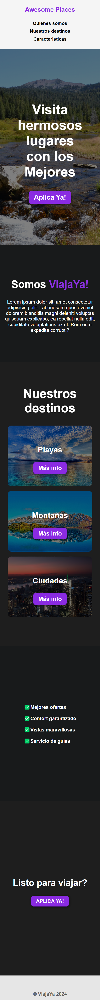

# Awesome Places

## Web preview

### Desktop view

### Mobile view

## Acknowledgement

### Project guided by the [Youtube](https://youtu.be/VgHproadDD8) tutorial of the [Freecodecamp](https://www.freecodecamp.org/) platform.
### Ver perfil de:
